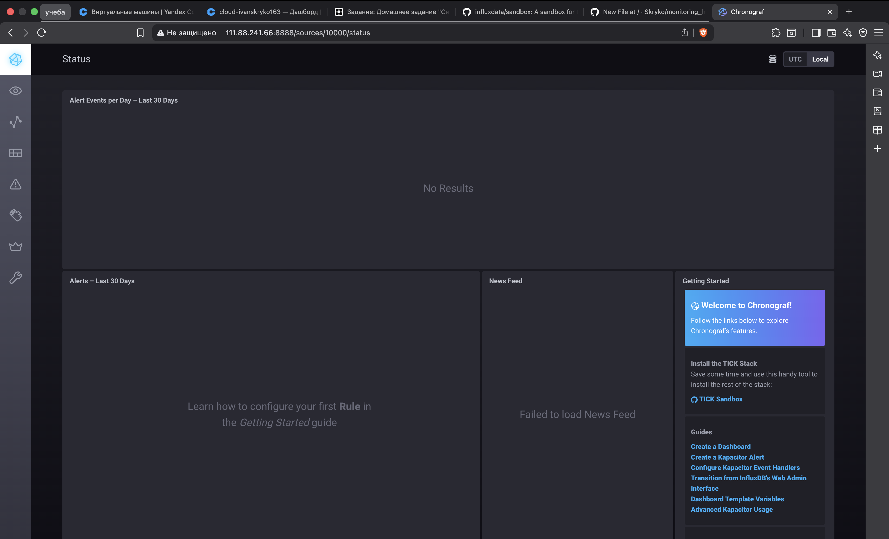
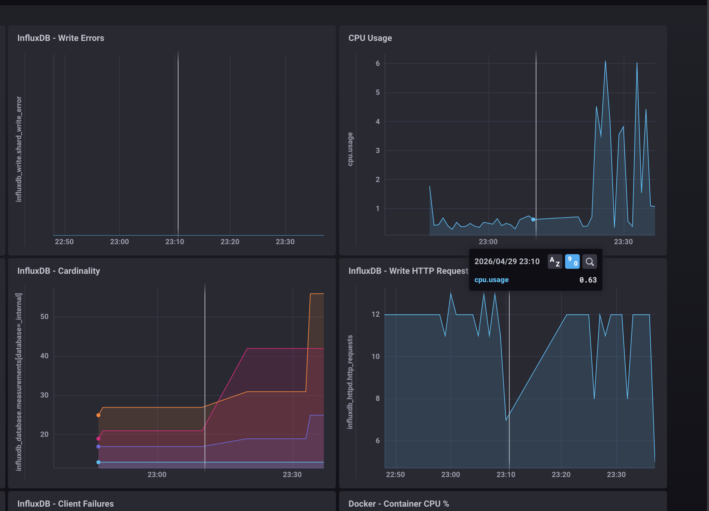
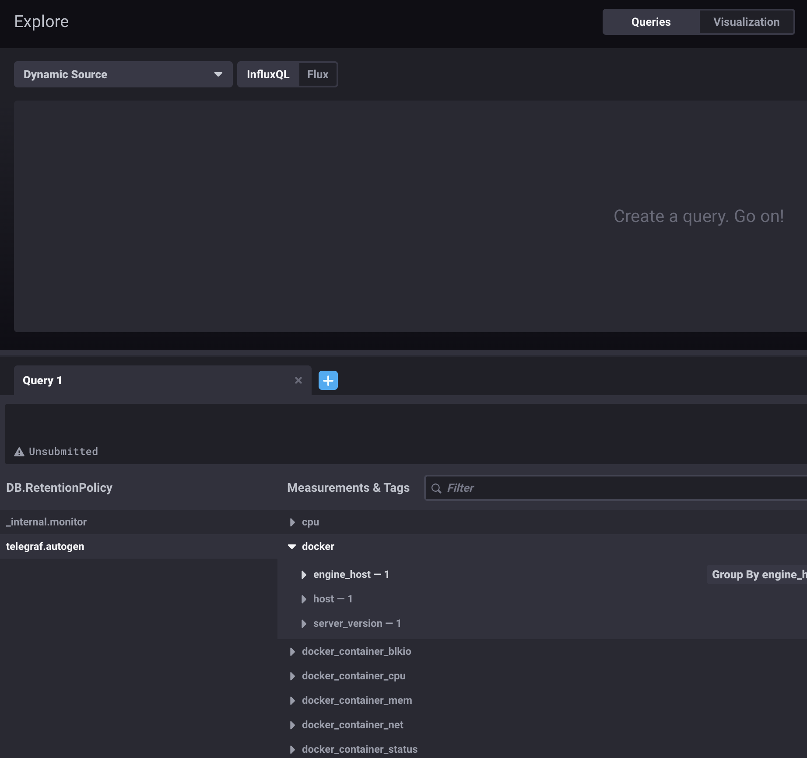

## 1. Минимальный набор метрик для мониторинга проекта

Проект представляет собой HTTP-платформу, которая выполняет вычисления и сохраняет текстовые отчёты на диск. Поэтому в мониторинг я бы вывел не все возможные метрики подряд, а минимальный набор, который поможет быстро понять состояние сервиса.

В первую очередь нужны HTTP-метрики: количество запросов, коды ответов и время ответа. Это позволит понять, работает ли сервис для пользователя, не стало ли больше ошибок и не начал ли сервис отвечать слишком долго. Даже если приложение не падает, но отвечает по 20 секунд, для клиента это уже проблема.

Так как на онбординге отдельно сказали, что вычисления нагружают процессор, обязательно нужно следить за CPU. Если процессор постоянно загружен почти на 100%, сервер может не успевать обрабатывать задачи. Со временем это приведёт к задержкам или отказам.

Также нужно отслеживать оперативную память. Если приложению не хватает RAM, система может начать активно использовать swap, из-за чего производительность сильно упадёт. Поэтому важно смотреть не только использование RAM, но и swap.

Отдельно я бы контролировал диск: свободное место, скорость чтения/записи и количество свободных inode. Поскольку отчёты сохраняются на диск, место может закончиться. А если отчётов много и они маленькие, могут закончиться inode, даже если свободное место ещё есть.

Минимальный набор метрик:

- HTTP-коды ответов: `2xx`, `3xx`, `4xx`, `5xx`
- время ответа HTTP-запросов
- количество запросов в секунду
- CPU usage
- Load Average
- использование RAM
- использование swap
- свободное место на диске
- Disk I/O
- свободные inode
- доступность HTTP endpoint, например `/health`

Такой набор позволит быстро понять, где проблема: в приложении, в нагрузке на CPU, в нехватке памяти или в диске.

---

## 2. Метрики для менеджера продукта

Менеджеру продукта технические показатели сами по себе не всегда полезны. Ему не обязательно понимать, что такое inode, RAM или Load Average. Ему важно понимать другое: работает ли сервис для клиентов, насколько быстро он отвечает и выполняем ли мы обещанный уровень качества.

Поэтому для менеджера я бы сделал отдельный дашборд с более понятными показателями:

- доступность сервиса
- процент успешных запросов
- среднее время ответа
- 95-й или 99-й перцентиль времени ответа
- количество успешно сформированных отчётов
- количество ошибок при формировании отчётов
- доля пользователей, которые столкнулись с ошибкой

Также можно использовать понятия SLA, SLI и SLO.

**SLA** — это то, что мы обещаем клиенту. Например, сервис должен быть доступен 99% времени.

**SLI** — это показатель, по которому мы это измеряем. Например, процент успешных HTTP-запросов или процент успешно сформированных отчётов.

**SLO** — это внутренняя цель по качеству. Например, 99% запросов должны завершаться успешно, а 95% запросов должны выполняться быстрее двух секунд.

То есть технические метрики вроде CPU, RAM и inode остаются для DevOps-команды, а для менеджера лучше показывать показатели качества сервиса с точки зрения клиента.

---

## 3. Решение без полноценной системы сбора логов

Если денег на полноценную систему сбора логов в этом году нет, я бы не стал сразу пытаться строить замену ELK или Loki из подручных средств. Для начала можно закрыть самую важную потребность разработчиков — видеть ошибки приложения.

Самый простой вариант — договориться с разработчиками, чтобы приложение отдавало ошибки как метрики.

Например:

```text
app_errors_total
app_http_500_total
app_report_generation_errors_total
```

Эти метрики можно собирать уже существующей системой мониторинга и настроить по ним алерты. Например, если за последние 5 минут появились ошибки генерации отчётов или HTTP 500, отправлять уведомление разработчикам в Telegram, почту или другой канал.

Если приложение пишет ошибки в journald или обычный лог-файл, можно временно сделать простой скрипт, который будет искать строки с `error`, `exception`, `fatal` и отправлять их разработчикам.

Например:

```bash
journalctl -u app.service --since "5 minutes ago" | grep -iE "error|exception|fatal"
```

Это не заменит полноценную систему логирования, но как временное решение позволит разработчикам видеть критичные ошибки без дополнительных расходов.

Ещё один вариант — подключить Sentry, если подходит бесплатный тариф или self-hosted установка. Sentry хорошо подходит именно для ошибок приложения, хотя и не является полноценной системой сбора всех логов.

---

## 4. Ошибка в расчёте SLA

SLA считается по формуле:

```text
summ_2xx_requests / summ_all_requests
```

На первый взгляд кажется, что если нет `4xx` и `5xx`, то SLA должен быть почти 100%. Но ошибка в том, что в `summ_all_requests` могут попадать не только `2xx`, `4xx` и `5xx`, но и, например, `3xx`.

`3xx` — это редиректы. Они не являются ошибками, но в текущей формуле они считаются в общем количестве запросов и при этом не считаются успешными.

Например:

```text
70 запросов получили 2xx
30 запросов получили 3xx
4xx = 0
5xx = 0
Всего запросов = 100
```

Тогда расчёт будет таким:

```text
70 / 100 = 70%
```

Ошибок действительно нет, но SLA выше 70% не поднимется, потому что 30% запросов — это редиректы.

Значит, ошибка в формуле или в понимании того, какие HTTP-коды считаются успешными. Если `3xx` являются нормальным поведением сервиса, их нужно учитывать как успешные:

```text
(summ_2xx_requests + summ_3xx_requests) / summ_all_requests
```

Либо нужно отдельно посмотреть распределение всех HTTP-кодов и понять, какие коды попадают в общий счётчик.

---

## 5. Pull и push системы мониторинга

Pull-модель — это когда сервер мониторинга сам ходит на приложения или агенты и забирает у них метрики. Например, так обычно работает Prometheus.

Плюсы pull-модели:

- управление сбором метрик находится в одном месте;
- сервер мониторинга сам знает, кого он опрашивает;
- удобно видеть, какой target сейчас доступен, а какой нет;
- хорошо подходит для Kubernetes и service discovery.

Минусы pull-модели:

- не всегда удобно мониторить серверы за NAT или firewall;
- нужно, чтобы система мониторинга могла достучаться до endpoint с метриками;
- короткоживущие задачи могут завершиться раньше, чем мониторинг успеет их опросить.

Push-модель — это когда агент или приложение сами отправляют метрики в систему мониторинга. Например, Telegraf собирает данные и отправляет их в InfluxDB.

Плюсы push-модели:

- удобно для закрытых сетей и NAT;
- подходит для короткоживущих задач;
- агенту достаточно иметь возможность отправить данные наружу.

Минусы push-модели:

- сложнее понять, что агент перестал работать;
- нужно отдельно контролировать отсутствие данных;
- при большом количестве агентов может появиться большая нагрузка на приёмную сторону.

В итоге pull удобнее там, где система мониторинга имеет прямой доступ к сервисам. Push удобнее там, где сервисы сами могут только отправлять данные наружу.

---

## 6. Классификация систем мониторинга

| Система | Модель |
|---|---|
| Prometheus | Pull, частично гибридный через Pushgateway |
| TICK | Push |
| Zabbix | Гибридная |
| VictoriaMetrics | Гибридная |
| Nagios | Pull, частично гибридный через дополнительные компоненты |

Prometheus в классическом варианте работает по pull-модели. Он сам забирает метрики с endpoint `/metrics`. Но у него есть Pushgateway для отдельных push-сценариев, поэтому иногда его можно считать частично гибридным.

TICK обычно относится к push-модели. В этом стеке Telegraf собирает метрики и отправляет их в InfluxDB. Chronograf используется для просмотра данных, а Kapacitor — для обработки и алертов.

Zabbix можно считать гибридной системой. Он умеет работать в обычном режиме, когда сервер сам опрашивает агенты. Но есть и Zabbix Agent Active, когда агент сам отправляет данные на сервер.

VictoriaMetrics тоже можно отнести к гибридным системам. Она умеет принимать данные, например через remote_write, а через vmagent может собирать метрики похожим образом на Prometheus.

Nagios в базовом варианте — это pull-система. Он сам выполняет проверки хостов и сервисов. Но с дополнительными компонентами можно реализовать и push-сценарии.

---

## 7. Практическая часть

TICK-стек был запущен с использованием Docker и docker-compose.

В Chronograf была открыта база:

```text
telegraf.autogen
```

В Data Explorer был выбран measurement `cpu`, host `telegraf-getting-started` и field `usage_system`. После этого был получен график утилизации CPU.

Также в конфигурацию Telegraf был добавлен input-плагин Docker:

```toml
[[inputs.docker]]
  endpoint = "unix:///var/run/docker.sock"
```

В контейнер Telegraf был проброшен Docker socket:

```yaml
- /var/run/docker.sock:/var/run/docker.sock
```

После перезапуска Telegraf в базе `telegraf.autogen` появились measurements, связанные с Docker:

```text
docker
docker_container_blkio
docker_container_cpu
docker_container_mem
docker_container_net
docker_container_status
```

Это подтверждает, что Telegraf начал собирать метрики Docker-контейнеров.

---

## Скриншоты

### Главная страница Chronograf



### График утилизации CPU



### Docker measurements в telegraf.autogen


